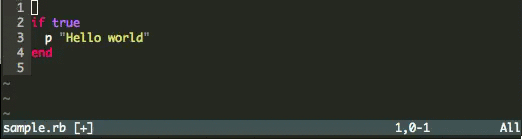

backend_if
==========



このプラグインはRubyの後置記法を支援します．

使用可能なのは本文が1行の`if`,`unless`,`while`,`until`文です．
# Installation

To install using NeoBundle:
Add this line to your .vimrc file

```
NeoBundle "Qureana/backend_if"

autocmd FileType ruby nnoremap gt :ToggleStatement<CR>
```

# Usage
 Open or create a Ruby File like this:

```
if true
  p "Hello world!"
end
```
Type `gt` on the `if` statement, you shold see:

```
p "Hello world!" if true
```
And type `gt` again, you shold see:

```
if true
  p "Hello world!"
end
```

